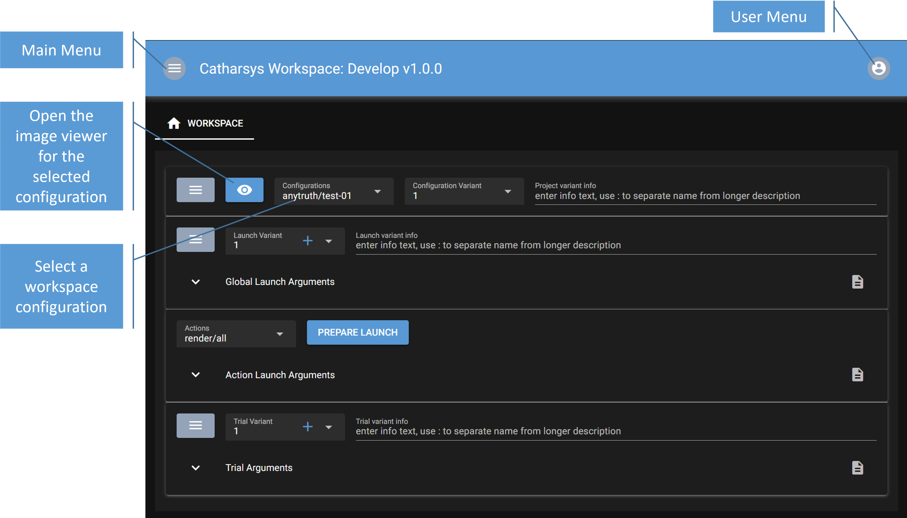
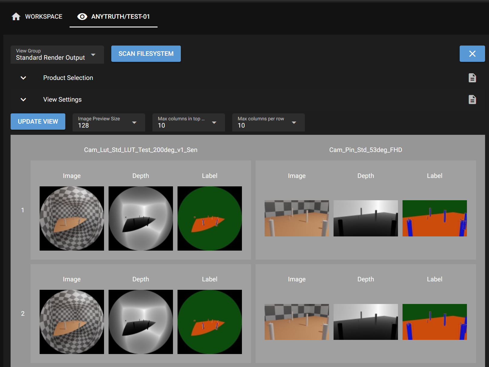
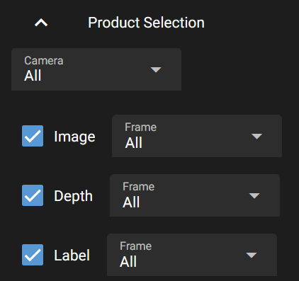
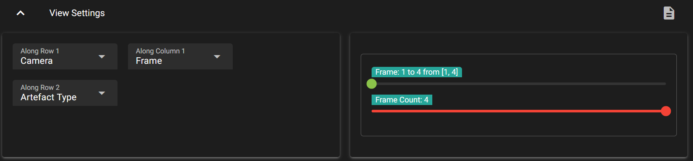
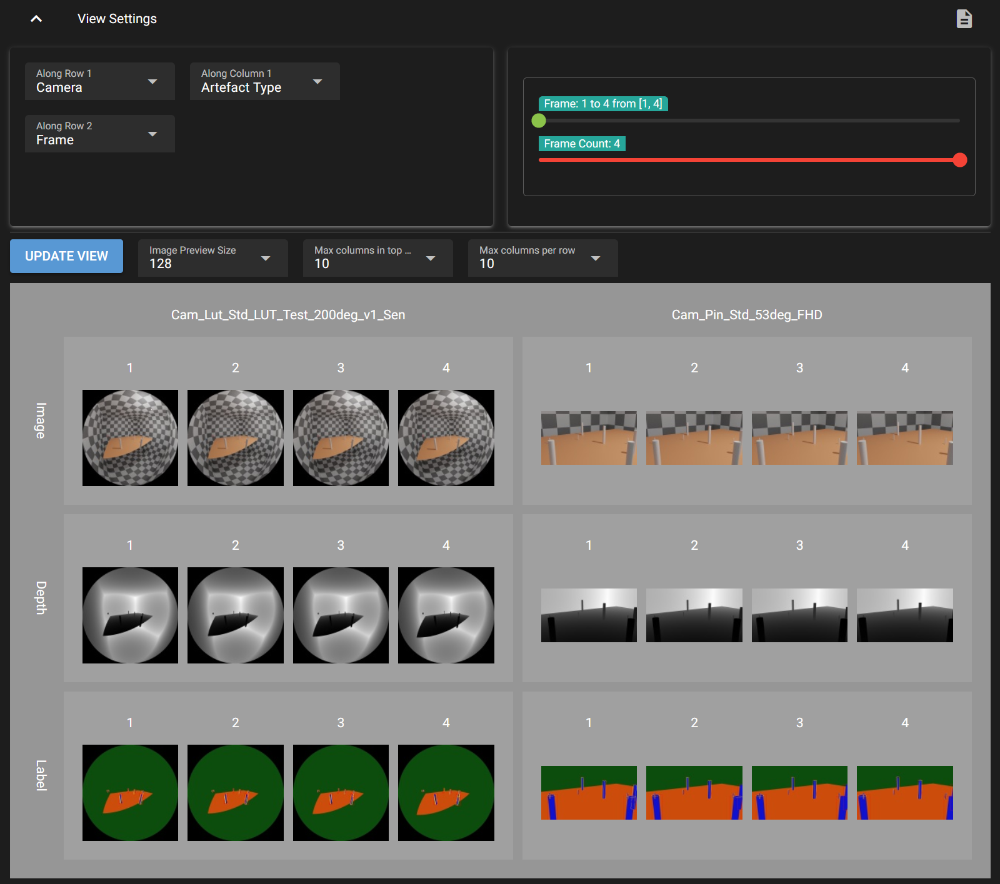
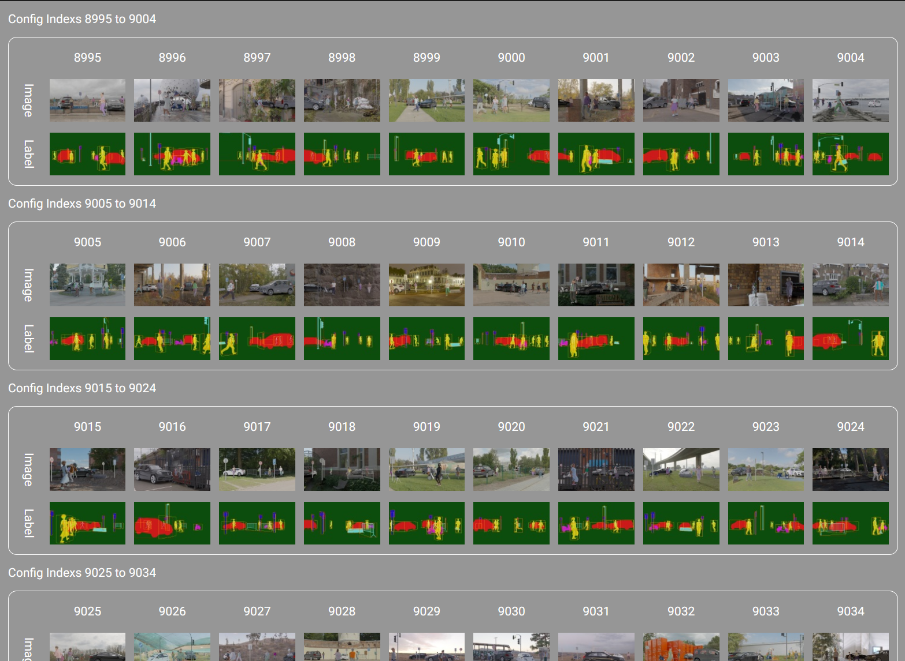
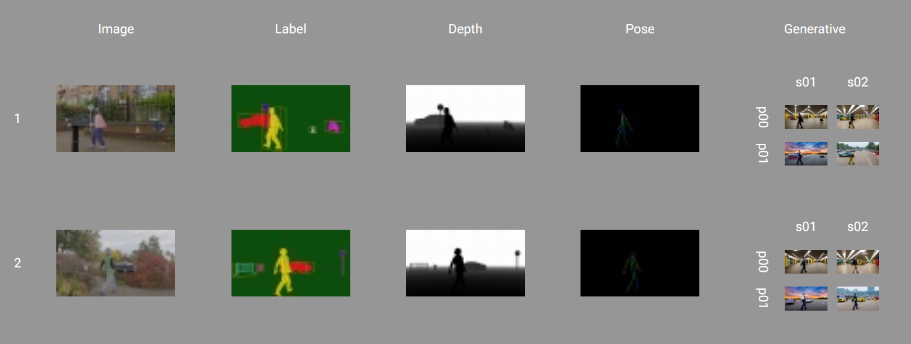

# Catharsys Web GUI - Getting Started

The Catharsys Web GUI is a web server that you start for a specific Catharsys workspace. The main idea is, that you can expose specific variables of your Catharsys configurations to be shown and modified in a web GUI. In this way, also people not familiar with a specific Catharsys configuraton setup, can run render jobs and vary the important parameters.

However, currently, the GUI can't be used to create a full configuration setup. This will be developed step-by-step.

Even if you are not using the GUI to start your renders, you can still use the image viewer to get a better overview of all the images and ground truth data rendered in the various variations. 


# Installation

Currently, the code is not published on GitHub, but is still on Social Coding. To use the GUI you therefore need to clone the repository from Social Coding. There is no automated installer. **You can currently only use the GUI code if you have a Catharsys development installation**. These are the installation steps:

<ol>
    <li>Open a terminal and activate your current Catharsys Conda environment, e.g. `conda activate cex1`.</li>
    <li>Update your Catharsys installation with `cathy repos update`</li>
    <li>Find a suitable folder to clone the GUI code to. Then run `git clone ssh://git@sourcecode.socialcoding.bosch.com:7999/render/image-render-gui.git`</li>
    <li>The `master` branch contains a stable version and the `develop` branch the latest features. Note that the whole project is still in a development phase.</li>
    <li>Enter the folder you just cloned and execute `pip install .` or `pip install -e .` if you want to modify the code.</li>
    <li>If everything installed correctly, you should now be able to run the command `cathy gui ws -h` from the command line.</li>
</ol>

# Setup

The command `cathy gui ws` has to be run from the top folder of a Catharsys workspace. The GUI does not allow you to work with multiple workspaces at the same time. Since this command starts a web server, it can be accessed by anyone who can access ports on your machine via the network. If you have a firewall or are on a local machine with no network access, you can just run `cathy gui ws`. This will start a web server with public access and open a web browser pointing to this server. 

## Users
If you need to secure access to the web server, you should create an admin user from the command line with:

```shell 
cathy gui ws --add-admin [your username]
```

You will be prompted for a password, which you need to repeat in a second step. This user and password are completely independent of your Windows user. This is just used for this web server. The user data is stored in the file `.cathgui/[Windows/Linux username]/gui-web-user.json`, whereby the passwords are hashed. 

**This is just a very simple user management structure. Anybody who has access to the workspace folder, can remove or change the users.**

## Web Config

The first time you start the web server, a configuration file is created in `.catharsys/[your conda environment]/gui/gui-web-config.json` and a port is chosen automatically by the system. You can set a fixed port here, if you want to change it. 

By default, a SSL web connection is created, so you need to access the web server via `https://`. For this purpose a certificate is created, which is used for the encryption. The created certificate is located at `.catharsys/[your conda environment]/gui/localhost-cert.pem`. This certificate is, of course, not signed by any authority, so your web browser, will warn you of an insecure connection. Nevertheless, the communication is encrypted, but anybody who has access to your workspace folder can copy this certificate. To use un-encrypted web communication, for example, when running the server just as GUI on your local machine, you can use the `--no-ssl` command line option.

# The Workspace View

After starting the web server with `cathy gui ws` in your workspace folder, a web browser should open showing you something like this:



We will start by looking at the image viewer feature. If you press the eye icon, a separate pane opens with the image viewer. For each configuration you can open a separate image viewer. First select the configuration and then press on the eye icon to open the respective viewer.

# The Image Viewer

## Basic Setup

For the image viewer to show you anything you first need to specify what it is supposed to show. This is specified in the file `production.json`, which you need to create in each configuration you want to use the viewer for. The basic idea here is, that you define a path search pattern, where the resultant 'artefacts' (images, data files, etc.) of running the Catharsys configuration can be found. To explain the details, consider the following folder tree of some render results as seen on the right:


We want to see the rendered images together with the depth and label images that are located in the opened folders on the right. The pattern we define is split into two parts:

1. A group path, that specifies everything down to the folder where the artefact folders start. In this case, one such path is `_render/rq0064/anytruth/test-01/std/30_fps/Cam_Lut_Std_LUT_Test_200deg_v1_Sen`. 
2. A set of artefact paths that describe the sub-paths that lead to the result data of the different artefacts. For example, one result image is located in the sub-path `Image/Frame_0001.png`, while the corresponding label preview image is under `AT_Label/full_res/Preview/Frame_0001.png`.

The path patterns can be defined as a combination of fixed path elements, pre-defined variable path elements and user defined, variable path elements. For this example, the path structure pattern looks like this:

```
!production/!rq/!project/std/?fps/?camera
```

All elements starting with a '!' are pre-defined variables, while elements starting with '?' are user defined variables. Elements starting with neither are fixed path elements. The meaning of the variables is as follows:

- `!production`: this is replaced by the main production path for this workspace. It's the absolute path including the `_render` folder, for example, `/data/renders/example/_render` if your workspace folder is  `/data/renders/example`.
- `!rq`: the render quality folder, which must be of the form `rq[xxxx]`, where `xxxx` stands for the render quality value.
- `!project`: the current project (confguration) folder. In this example, `anytruth/test-01`. 
- `?fps`: this is any folder, used a result dimension `fps`. In this example, `30_fps`.
- `?camera`: this is any folder, used as a result dimension `camera`. In this example, `Cam_Lut_Std_LUT_Test_200deg_v1_Sen`.

The actual artefacts that are shown, are specified with separate path structure patterns, one for each artefact you want to see. For example, the artefacts in this example are specified with the following patterns:

- **Images**: `Image/!frame`
- **Depth**: `AT_Depth/full_res/Preview/!frame`
- **Label**: `AT_Label/full_res/Preview/!frame`

The pre-defined variable `!frame` stands for any file with the name pattern `Frame_[number].[suffix]`. The various artefacts can have variables that are the same over a number of artefacts, like the frame file. The viewer associates the values in the view of these variables. However, some artefacts may have additional variables. These generate a sub-grid. An example of this is shown later on.

Any variable, pre-defined or user, creates a dimension in the result data presentation. The viewer creates a regular, nested grid of all dimensions with more than one element.

Here is an example `production.json`:

```json
{
    // The data-type-information (DTI) string. It must be exactly this.
    sDTI: "/catharsys/production:1.0",

    // You can specify a number of view groups that can be selected in the viewer
    mGroups: {

        // this is the id of a view group. You can use any id name here.
        std: {
            // This is the displayed name for this view group
            sName: "Standard Render Output",
            // This is the group path structure, as explained above
            sPathStructure: "!production/!rq/!project/std/?fps/?camera",
            // The user defined variables are described here.
            // Currently, you can only define a display name. In future versions
            // additional parameters per use variable may be defined here.
            mVars: {
                "fps": {
                    sName: "FPS",
                },
                "camera": {
                    sName: "Camera",
                },
            },

            // This is the block where all artefacts are defined
            mArtefacts: {
                // This is the artefact id. You can use any name here.
                images: {
                    // This DTI specifies the type of the artefact object.
                    // In this case, these are PNG images. Other supported image file
                    // extensions are 'jpg' and 'exr'.
                    sDTI: "/catharsys/production/artefact/image/png:1.0",
                    // This is the display name of the artefact
                    sName: "Image",
                    // The artefact path structure pattern
                    sPathStructure: "Image/!frame",
                },
                depth: {
                    sDTI: "/catharsys/production/artefact/image/png:1.0",
                    sName: "Depth",
                    sPathStructure: "AT_Depth/full_res/Preview/!frame",
                },
                label: {
                    sDTI: "/catharsys/production/artefact/image/png:1.0",
                    sName: "Label",
                    sPathStructure: "AT_Label/full_res/Preview/!frame",
                },
                focus: {
                    sDTI: "/catharsys/production/artefact/image/png:1.0",
                    sName: "Focus",
                    sPathStructure: "Focus/?fd/!frame",
                    // specification of the user variables for the artefact path structure
                    mVars: {
                        "fd": {
                            sName: "Focus distance",
                        },
                    }
                },
            } // end artefacts
        }, // end view group
    }, // end groups
}
```

The viewer output could for example look like this:



If you open the product selection block (by clicking on it), you can select which artefacts are shown and for each variable you can select which elements to show.



The view settings block allows you to define the order of the dimensions and also select ranges for variables with more than a few elements. This may look like this:



For example, if you change the order of the dimensions you could obtain this view:



If you have many elements in a row, the row can be wrapped. Use the options `Max columns in top row` to set the maximal number of elements before wrapping in the top row and `Max columns per row` to the the maximal number for all following nested rows. This may look like this:



If you have artefacts that have unique variables, they are displayed in a sub-grid. Here is an example of this, where the generative render contains 2 different prompts and for each of those two different seeds:




## Displaying Meta Data

You can also display meta information per artefact. For example, in one configuration we create one json file per image created by with a generative DNN method. Part of this json file looks, for example, like this:

```json
{
    "sPrompt": "A university student is waiting at underground subway station after school.",
    "sNegativePrompt": "disfigured, bad, immature, cartoon, anime, 3d, painting, b&w, monochrome, lowres, bad anatomy, worst quality, low quality",
    "iSeed": 1,
    "iNumSteps": 20,
    "mImage": {
        "iWidth": 960,
        "iHeight": 544
    },
}
```

These JSON files are stored in a folder `control` next to the artefact image, using the name pattern `Frame_[number]_config.json`. The following artefact configuration accesses the elements `sPrompt` and `sNegativePrompt` from the JSON5 file and displays it as tooltip if you hover over the respective image.

```json
    mArtefacts: {
        generative: {
            sDTI: "/catharsys/production/artefact/image/png:1.0",
            sName: "Generative",
            sPathStructure: "Takuma-Diffusers/?gen-cfg/?gen-prompt-cfg/?prompt/?seed/!frame",

            // This block can contain any number of meta data references
            mMeta: {
                // This is an arbitrary id for this meta data type
                Config: {
                    // For JSON meta data you need to use this DTI
                    sDTI: "/catharsys/production/artefact/meta/json:1.0",
                    // The name of the meta data
                    sName: "Takuma Config",
                    // The path relative to the meta data file from the artefact
                    // This path is parsed with the ISON parser, whereby all path structure
                    // variables from the group path and the artefact path are available
                    // as variables. For example, the `$frame` expression references the
                    // current value of the pre-defined variable `!frame`. 
                    // The `$path.stem{}` is an ISON function that picks out the stem of a 
                    // filename. For example, for 'Frame_0001.png' this would be 'Frame_0001'.
                    sRelPath: "control/$path.stem{$frame}_config.json",
                    // This block defines how the meta data should be printed.
                    // There may be various ways the data is shown.
                    mPrint: {
                        // Currently, only the print type 'tooltip' is defined. 
                        tooltip: {
                            // This gives a list of lines to printed.
                            // Each string is again parsed with the ISON parser.
                            // In addition to the path structure variables, the whole JSON file
                            // loaded as meta data is available in the variable `meta_data`.
                            // You can pick out elements from the meta data dictionary using the
                            // ':'-notation. That is, the element 'sPrompt' from the JSON file is
                            // picked with `${meta_data:sPrompt}`. 
                            // The element 'iWidth' could be retrieved with `${meta_data:mImage:iWidth}`.
                            lLines: [
                                "Prompt: ${meta_data:sPrompt}",
                                "Neg. Prompt: ${meta_data:sNegativePrompt}",
                            ],
                        },
                    },
                },
            },
        },
    },
```

