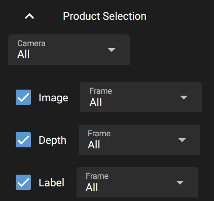
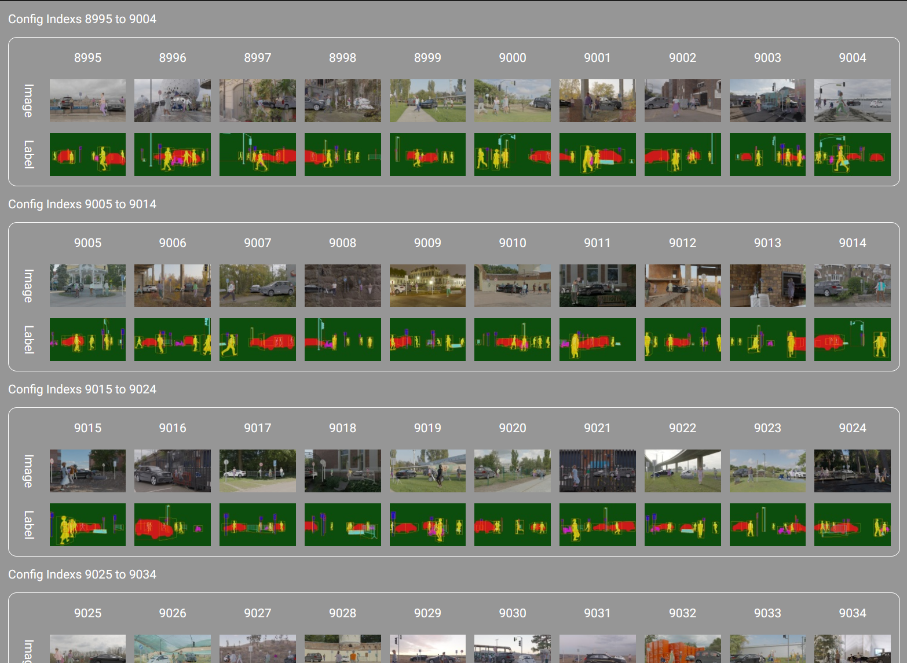
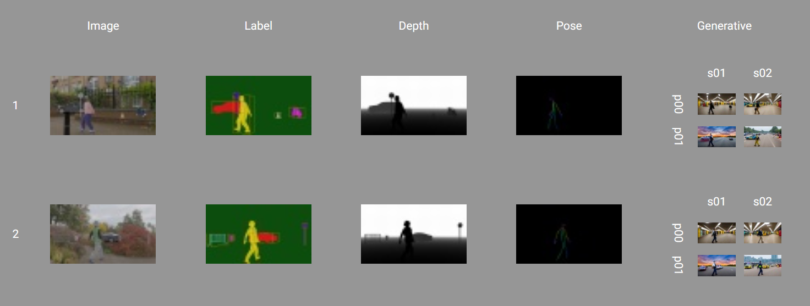

<!---
<LICENSE id="CC BY-SA 4.0">
    
    Image-Render Setup module documentation
    Copyright 2022 Robert Bosch GmbH and its subsidiaries
    
    This work is licensed under the 
    
        Creative Commons Attribution-ShareAlike 4.0 International License.
    
    To view a copy of this license, visit 
        http://creativecommons.org/licenses/by-sa/4.0/ 
    or send a letter to 
        Creative Commons, PO Box 1866, Mountain View, CA 94042, USA.
    
</LICENSE>
--->
# Web Image Viewer

## Basic Setup

:::{image} assets/artefact-tree-01.png
:width: 250px
:class: float-end
:::

For the image viewer to show you anything you first need to specify what it is supposed to show. This is specified in the file `production.json`, which you need to create in each configuration you want to use the viewer for. The basic idea here is, that you define a path search pattern, where the resultant 'artefacts' (images, data files, etc.) of running the Catharsys configuration can be found. To explain the details, consider the following folder tree of some render results as seen on the right.

We want to see the rendered images together with the depth and label images that are located in the opened folders on the right. The pattern we define is split into two parts:

1. A group path, that specifies everything down to the folder where the artefact folders start. In this case, one such path is `_render/rq0064/anytruth/test-01/std/30_fps/Cam_Lut_Std_LUT_Test_200deg_v1_Sen`. 
2. A set of artefact paths that describe the sub-paths that lead to the result data of the different artefacts. For example, one result image is located in the sub-path `Image/Frame_0001.png`, while the corresponding label preview image is under `AT_Label/full_res/Preview/Frame_0001.png`.

The path patterns can be defined as a combination of fixed path elements, pre-defined variable path elements and user defined, variable path elements. For this example, the path structure pattern looks like this:

```
!production/!rq/!project/std/?fps/?camera
```

All elements starting with a '!' are pre-defined variables, while elements starting with '?' are user defined variables. Elements starting with neither are fixed path elements. The meaning of the variables is as follows:

- `!production`: this is replaced by the main production path for this workspace. It's the absolute path including the `_render` folder, for example, `/data/renders/example/_render` if your workspace folder is  `/data/renders/example`.
- `!rq`: the render quality folder, which must be of the form `rq[xxxx]`, where `xxxx` stands for the render quality value.
- `!project`: the current project (confguration) folder. In this example, `anytruth/test-01`. 
- `?fps`: this is any folder, used a result dimension `fps`. In this example, `30_fps`.
- `?camera`: this is any folder, used as a result dimension `camera`. In this example, `Cam_Lut_Std_LUT_Test_200deg_v1_Sen`.

The actual artefacts that are shown, are specified with separate path structure patterns, one for each artefact you want to see. For example, the artefacts in this example are specified with the following patterns:

- **Images**: `Image/!frame`
- **Depth**: `AT_Depth/full_res/Preview/!frame`
- **Label**: `AT_Label/full_res/Preview/!frame`

The pre-defined variable `!frame` stands for any file with the name pattern `Frame_[number].[suffix]`. The various artefacts can have variables that are the same over a number of artefacts, like the frame file. The viewer associates the values in the view of these variables. However, some artefacts may have additional variables. These generate a sub-grid. An example of this is shown later on.

Any variable, pre-defined or user, creates a dimension in the result data presentation. The viewer creates a regular, nested grid of all dimensions with more than one element.

:::{note}
The same configuration is used by the `cathy prod` commands, that allow you to analyze the generated artefacts. See {external+image-render-automation:doc}`products/analyze` for more details.
:::

Here is an example `production.json`:

```json
{
    // The data-type-information (DTI) string. It must be exactly this.
    "sDTI": "/catharsys/production:1.0",

    // You can specify a number of view groups that can be selected in the viewer
    "mGroups": {

        // this is the id of a view group. You can use any id name here.
        "std": {
            // This is the displayed name for this view group
            "sName": "Standard Render Output",
            // This is the group path structure, as explained above
            "sPathStructure": "!production/!rq/!project/std/?fps/?camera",
            // The user defined variables are described here.
            // Currently, you can only define a display name. In future versions
            // additional parameters per use variable may be defined here.
            "mVars": {
                "fps": {
                    "sName": "FPS",
                },
                "camera": {
                    "sName": "Camera",
                },
            },

            // This is the block where all artefacts are defined
            "mArtefacts": {
                // This is the artefact id. You can use any name here.
                "images": {
                    // This DTI specifies the type of the artefact object.
                    // In this case, these are PNG images. Other supported image file
                    // extensions are 'jpg' and 'exr'.
                    "sDTI": "/catharsys/production/artefact/image/png:1.0",
                    // This is the display name of the artefact
                    "sName": "Image",
                    // The artefact path structure pattern
                    "sPathStructure": "Image/!frame",
                },
                "depth": {
                    "sDTI": "/catharsys/production/artefact/image/png:1.0",
                    "sName": "Depth",
                    "sPathStructure": "AT_Depth/full_res/Preview/!frame",
                },
                "label": {
                    "sDTI": "/catharsys/production/artefact/image/png:1.0",
                    "sName": "Label",
                    "sPathStructure": "AT_Label/full_res/Preview/!frame",
                },
                "focus": {
                    "sDTI": "/catharsys/production/artefact/image/png:1.0",
                    "sName": "Focus",
                    "sPathStructure": "Focus/?fd/!frame",
                    // specification of the user variables for the artefact path structure
                    "mVars": {
                        "fd": {
                            "sName": "Focus distance",
                        },
                    }
                },
            } // end artefacts
        }, // end view group
    }, // end groups
}
```

The viewer output could for example look like this:


If you open the product selection block (by clicking on it), you can select which artefacts are shown and for each variable you can select which elements to show.



The view settings block allows you to define the order of the dimensions and also select ranges for variables with more than a few elements. This may look like this:


For example, if you change the order of the dimensions you could obtain this view:


If you have many elements in a row, the row can be wrapped. Use the options `Max columns in top row` to set the maximal number of elements before wrapping in the top row and `Max columns per row` to the the maximal number for all following nested rows. This may look like this:



If you have artefacts that have unique variables, they are displayed in a sub-grid. Here is an example of this, where the generative render contains 2 different prompts and for each of those two different seeds:




## Displaying Meta Data

You can also display meta information per artefact. For example, in one configuration we create one json file per image created by with a generative DNN method. Part of this json file looks, for example, like this:

```json
{
    "sPrompt": "A university student is waiting at underground subway station after school.",
    "sNegativePrompt": "disfigured, bad, immature, cartoon, anime, 3d, painting, b&w, monochrome, lowres, bad anatomy, worst quality, low quality",
    "iSeed": 1,
    "iNumSteps": 20,
    "mImage": {
        "iWidth": 960,
        "iHeight": 544
    },
}
```

These JSON files are stored in a folder `control` next to the artefact image, using the name pattern `Frame_[number]_config.json`. The following artefact configuration accesses the elements `sPrompt` and `sNegativePrompt` from the JSON5 file and displays it as tooltip if you hover over the respective image.

```json
    "mArtefacts": {
        "generative": {
            "sDTI": "/catharsys/production/artefact/image/png:1.0",
            "sName": "Generative",
            "sPathStructure": "Takuma-Diffusers/?gen-cfg/?gen-prompt-cfg/?prompt/?seed/!frame",

            // This block can contain any number of meta data references
            "mMeta": {
                // This is an arbitrary id for this meta data type
                "Config": {
                    // For JSON meta data you need to use this DTI
                    "sDTI": "/catharsys/production/artefact/meta/json:1.0",
                    // The name of the meta data
                    "sName": "Takuma Config",
                    // The path relative to the meta data file from the artefact
                    // This path is parsed with the ISON parser, whereby all path structure
                    // variables from the group path and the artefact path are available
                    // as variables. For example, the `$frame` expression references the
                    // current value of the pre-defined variable `!frame`. 
                    // The `$path.stem{}` is an ISON function that picks out the stem of a 
                    // filename. For example, for 'Frame_0001.png' this would be 'Frame_0001'.
                    "sRelPath": "control/$path.stem{$frame}_config.json",
                    // This block defines how the meta data should be printed.
                    // There may be various ways the data is shown.
                    "mPrint": {
                        // Currently, only the print type 'tooltip' is defined. 
                        "tooltip": {
                            // This gives a list of lines to printed.
                            // Each string is again parsed with the ISON parser.
                            // In addition to the path structure variables, the whole JSON file
                            // loaded as meta data is available in the variable `meta_data`.
                            // You can pick out elements from the meta data dictionary using the
                            // ':'-notation. That is, the element 'sPrompt' from the JSON file is
                            // picked with `${meta_data:sPrompt}`. 
                            // The element 'iWidth' could be retrieved with `${meta_data:mImage:iWidth}`.
                            "lLines": [
                                "Prompt: ${meta_data:sPrompt}",
                                "Neg. Prompt: ${meta_data:sNegativePrompt}",
                            ],
                        },
                    },
                },
            },
        },
    },
```

