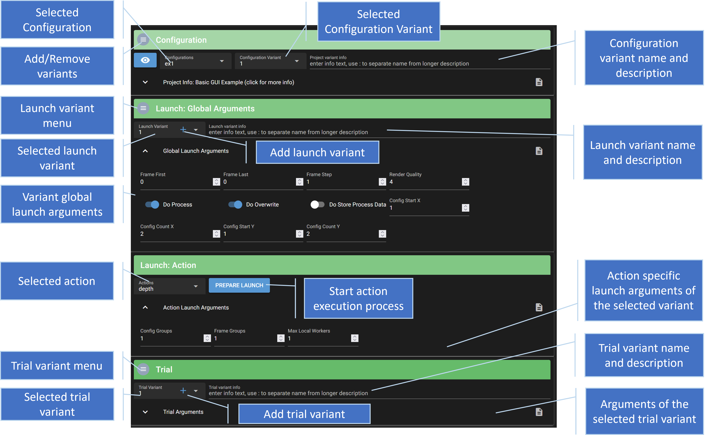

# Modify Configurations

## Overview

The main workspace view allows you to modify the launch, action and trial parameters of a configuration and execute an action. When modifying parameters here, the original parameters are not changed, however. Instead, variants of the whole configuration, the launch and the trial parameters are created, which may then be modified. 

## Variants

The variants are implemented by creating a copy of the launch and trial files. These copies can then be modified by the user. When an action is executed for a specific variant, the whole configuration with all configuration files if copied to an execution instance folder, replacing the launch and trial files with the version of the currently selected variant. This also allows the user to modify the parameters of a variant, while an action is executed on the variant, as the execution uses a separate, temporary copy of the configuration files.

The following shows an exemplary folder structure that may be created via the web gui.

You can give a name and description to each variant, to more easily go back to certain configurations. If the name includes a ':', then the text in front of the ':' is the short title used in the drop-down box.

You can create and delete variants via the menus. You can also add variants with the `+` buttons in the variant selection fields. 

## Launch Arguments

By default, all global launch arguments that are pre-defined by the Catharsys system are available for modification in the GUI. Furthermore, all user defined launch arguments are automatically available, if they follow the following naming convention: 

- the first letter is one of the following lowercase letters: 
    - `i`: integer value
    - `f`: float value
    - `b`: bool value
    - `s`: string value
- The second letter must be an uppercase letter.
- If the rest of the variable name uses camel case for multiple words, spaces are inserted between words for the description.

For example, `iConfigCount`, will generate an integer input field with the name `Config Count`.

