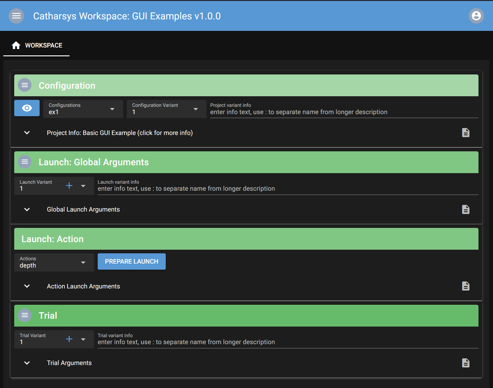
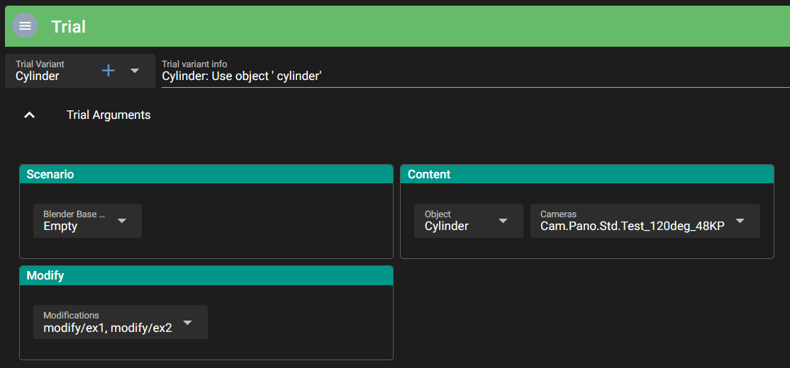
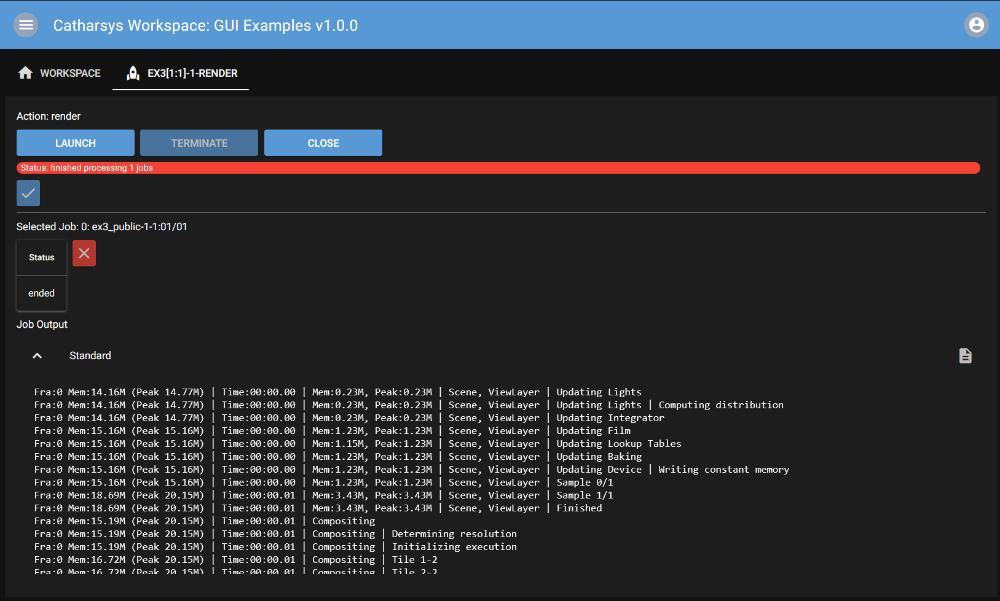
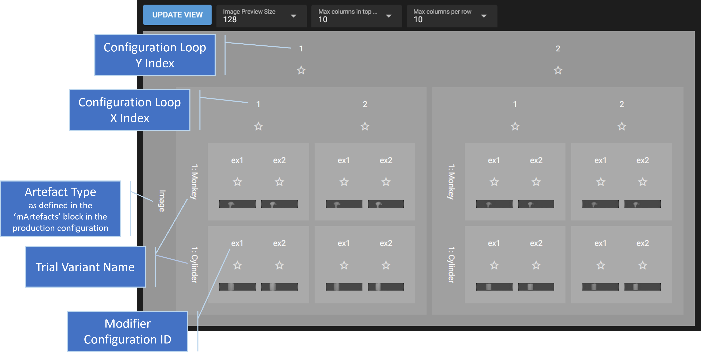
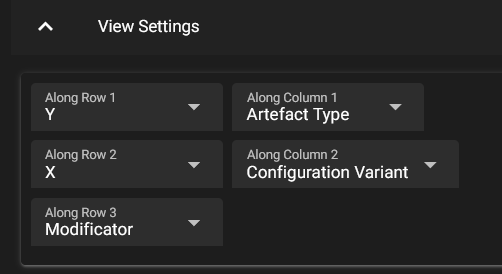
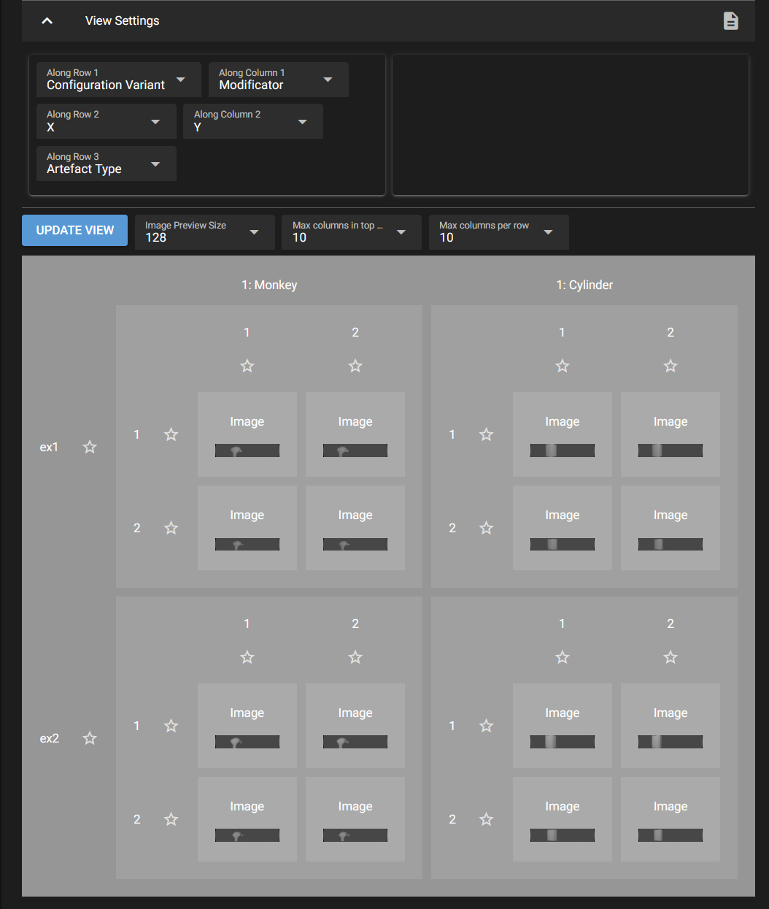
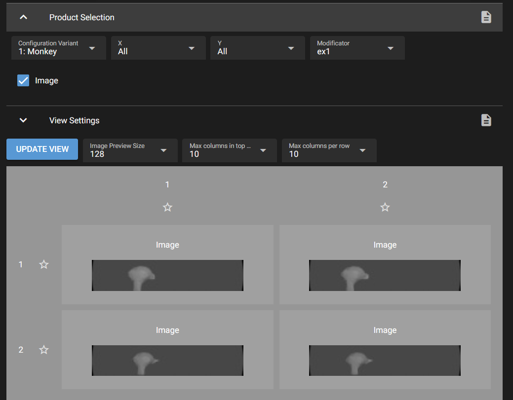
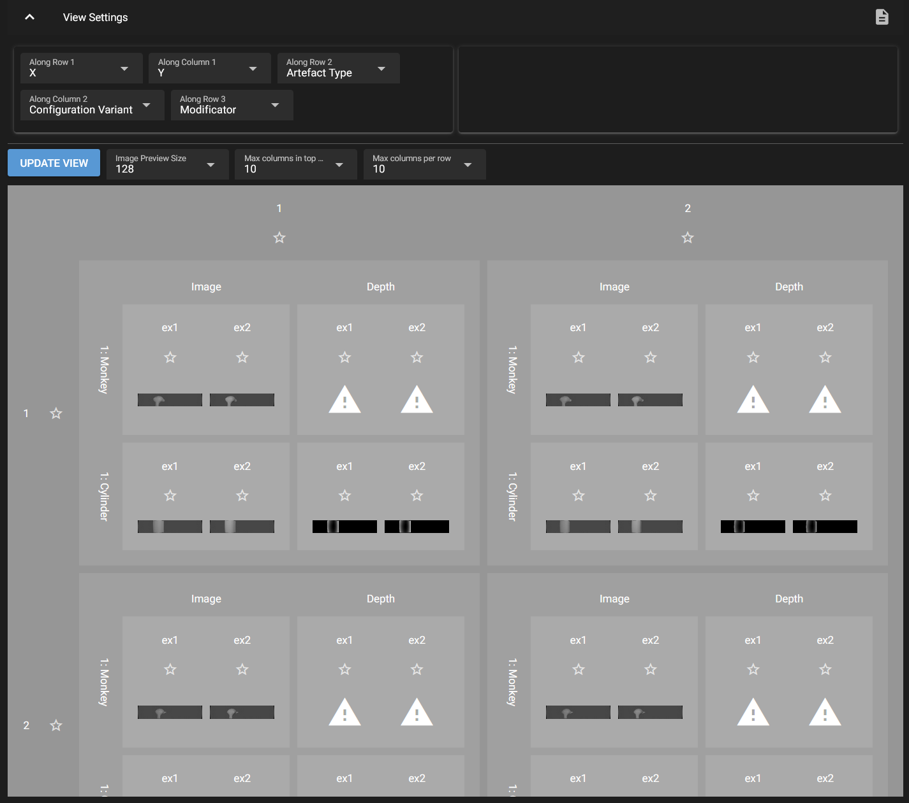

# Example Workflow

This is a walkthrough of a typical workflow using Catharsys for rendering and post-processing with the web GUI. 

To follow along with this example, you need to have Catharsys installed ({external+image-render-setup:doc}`setup`). Then clone the workspace [`image-render-workspace-ex-gui`](https://github.com/boschresearch/image-render-workspace-ex-gui) and in the top folder of the cloned repository run 

```{admonition} Shell
cathy blender init --all --addons
```

This only works if Blender 4.1 is already installed in the Catharsys system. Otherwise, install Blender 4.1 in Catharsys as described here: {external+image-render-setup:ref}`blender-setup`.

```{admonition} TL;DR
Open a terminal in the main folder of the cloned example workspace, run `cathy gui ws` which should open a web browser, select configuration `ex3` in the shown workspace view, select action `render`, click `prepare launch`, launch the render, go back to workspace tab, click the eye-icon, click `Scan Filesystem` and then `Update View`.
```

## 1. Prepare the Project

The first step is to prepare your Catharsys project for use with the GUI. 

```{note}
If you cloned the example, it is already prepared and you can go to section 2. 
```

If you just use a standard configuration you will also have a minimal GUI that allows you to start renders and post-processing actions. However, not all arguments you are interested in may be visible and the GUI can be overloaded with parameters a user doesn't need to or shouldn't change.

- To specify what parameters are displayed how, see {doc}`modify_configs` and the reference sections {doc}`reference/controls` and {doc}`reference/gui_def`.
- To see the rendered images in the image viewer, you first need to specify the path structure of the rendered images in the `production.json` configuration. See {doc}`image_viewer` and {external+image-render-automation:doc}`products/analyze` for a detailed description.
- To allow the user to flag or evaluate images or categories, see {external+image-render-automation:doc}`products/categorize` for a detailed description. The example configurations `ex1`, `ex2` and `ex3` of `image-render-workspace-ex-gui` contain such a definition.


## 2. Start the Web Server

To run the web server locally with standard settings, just execute

```{admonition} Shell
    cathy gui ws
```



You can access the web server with an `http` instead of a `https`-connection by starting it with the option `--no-ssl`:

```{admonition} Shell
    cathy gui ws --no-ssl
```

This will open a web-browser automatically with the workspace view. You can also start the web server on any other machine and then connect to it via one of the IP adresses shown in the terminal. You may have to establish an SSH tunnel for this to work. If you are using a terminal in VSCode on a remote machine, then VSCode will establish an SSH tunnel automatically. For more details on setting up the web server and creating user accounts, see {doc}`get_started`.

```{important}
Note that all configuration variants and other settings and result data, are stored independently per OS-user. This allows multiple OS-users to run web servers on the same workspace concurrently.
```

## 3. Set the Parameters

Select the configuration `ex3` and unfold the global launch, action and trial parameter views.


### Name the trial variant

Name the trial variant `Monkey: Use object 'Monkey'` in the field next to the variant selection. The text in front of the `:` is used as name in the drop-down selection box.


### Create new trial variant

Create a new trial variant by clicking on the `+` next to the trial variant name.


Now give the second trial a name and change the rendered object to `cylinder` as shown here:



You can, of course, also change any other settings, like the set of cameras to use or which modifiers to apply.

## 4. Render Variants

Select the first trial variant `Monkey` and in the action block select the `render` action as shown here:


Then click the `Prepare Launch` button next to the action. This will create a copy of all configuration files for the currently selected variants and open this new view:


You can still go back to the workspace view by clicking on `WORKSPACE` at the top and return to this launch screen. This is also possible, while the actual rendering is running. Note that changing configuration parameters while the rendering runs **is** possible, since the render job(s) use a copy of all configuration files. However, this makes it more difficult to associate a configuration with the rendered images.

```{note}
The variant files and launch instances are stored in a folder `.variants-[system user id]` inside the corresponding configuration folder. This enables multiple system users to start a web server for the same workspace concurrently. Inside a variants folder, the actually modified configuration files are stored in sub-folders per web user as managed by the Catharsys web view.
```

If you press the `Launch` button the action, in this case the rendering, starts. The output can be seen in the `Job Output` area. If the web server runs on a GPU cluster with an LSF job management system and the execution configuration configures the use of that system, you may see a number of jobs in this view. The job status is shown but the job's output is only available once the job finishes.

If you press the `Close` button, all jobs are terminated and the copy of the configuration files created for the processing is deleted. The view is also closed and you return to the workspace view.

Now press `Launch` and wait for the images to be rendered. The progress is also shown in the status line below the buttons. When the rendering is finished the view should look like this:



Press the `Close` button to close the view and delete the configuration instance files used for this rendering.

Now select the `Cylinder` trial variant and render the images the same way as before.

## 5. Show Rendered Images

To view the rendered images, select the eye-icon in the workspace view, next to the configuration selection, as shown here:


This creates a new tab, which initially looks like this:


Note, that you can open a viewer for each configuration in the workspace concurrently. To view the generated images, first click on `Scan Filesystem` and the `Update View`. 

```{note}
You have to re-scan the filesystem every time you render new artefacts (images, depth, ground truth, etc.). The `Update View` button has to be pressed every time the file system was re-scanned, or the product or view settings were changed.
```



```{note}
The category of a label is shown, when you hover with the mouse over the label.
```

### View Settings

The order of the variation dimensions is set in the view settings, which currently look like this:



You can order the variation dimensions arbitrarily. Here is another order:



If you go back to the workspace settings, you can modify the parameters, render again, then re-scan the filesystem in the viewer and update the view, to see the effect of the changes.

### Production Selection

In the `Product Selection` block, you can select which elements are shown per variation dimension. By default all elements are selected in each dimension. Here is an example of selecting only a sub-set of all products:



## Additional Artefacts

If you execute the depth action from the workspace view for just the cylinder trial variant, and the re-scan and update the view, the output looks like this:



As no depth images have been generated for the trial variant `Monkey`, the missing elements are displays as a warning triangle.

## 6. Marking Categories

The production configuration defines the category `Favourite` as a boolean and associates it with the camera, the two loops and the modifier. The empty stars in the image viewer can be clicked to select the category `Favourite` for a specific element in one of the variables. For example, for one of the loops you can select one index to make it your favourite. For more details see {external+image-render-automation:doc}`products/categorize`.

The selected categories are written immediately to JSON file in the `_output/[os user]/[web user]` directory of the corresponding workspace. The `os-user` is the user logged into the OS and the `web-user` is the user logged into the Catharsys web GUI. If no explicit web users were created, the `web-user` is `public`. This file can be analysed later for further post-processing of the selected data.


